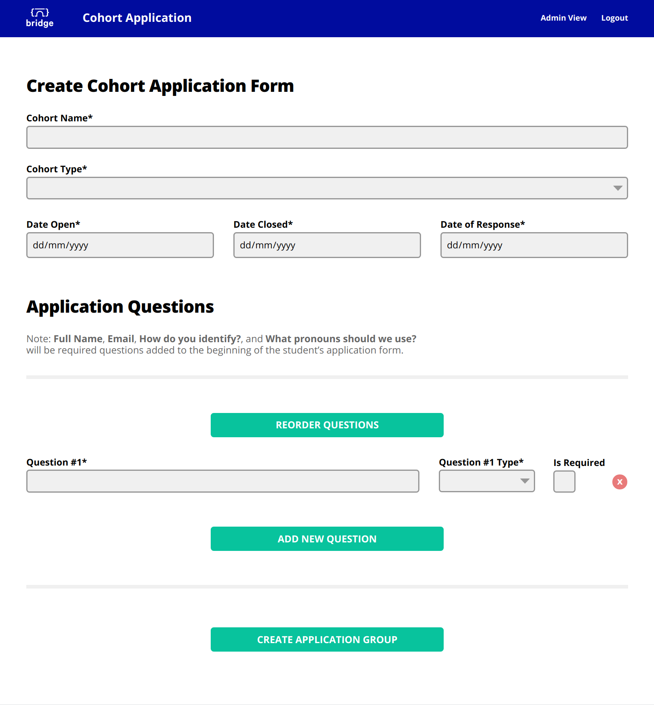
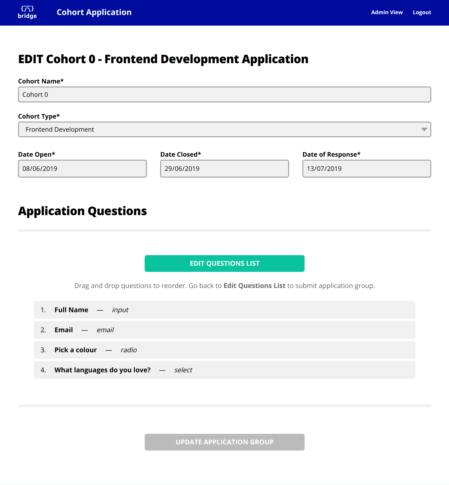
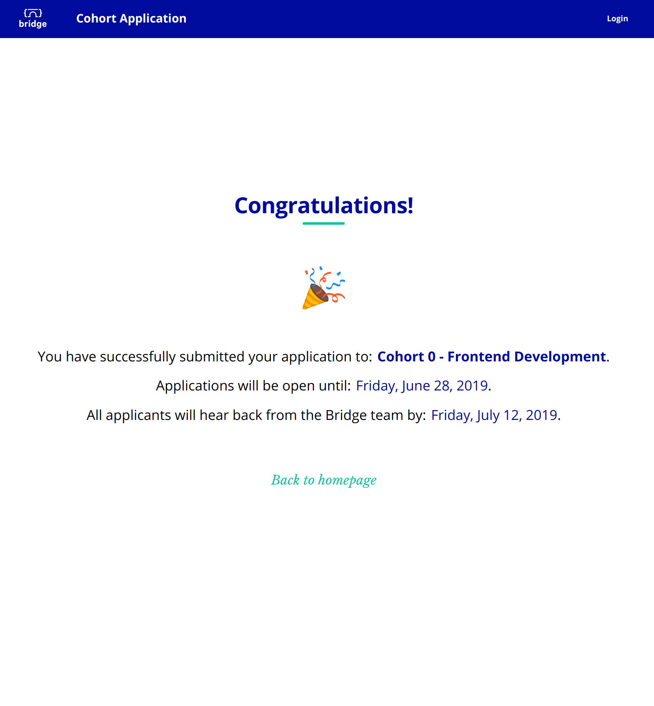

# Bridge School Applications Website

http://applications-frontend.bridgeschoolapp.io/

Website for potential students to apply to Bridge School. Admin can login, see all created cohort forms, create/update forms, add questions of different types and drag & drop to reorder questions. Students can apply to open cohorts and sees a confirmation page upon successful submission.

Login: email - test@bridgeschoolapp.io / password - Test123

Front-end: **React, Redux, Styled Components, Jest, React Testing Library, Cypress**

Back-end: **Node.js, Express, Firebase**

Back-end repo: https://github.com/bridge-school/applications-backend

